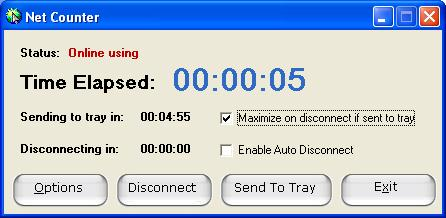



## Net Counter 2\.0

### Description

This is a Net time counter. When run, it logs relevant details about the connection (such as start time, time elapsed...) in a log in a folder you choose (Default: My Documents) when an established internet connection is severed. Includes an auto-disconnect feature whose time can be configured. When program is sent to tray, right-clicking on it's icon will display the elapsed time as well as offer options such as disconnect, maximize... Log generated can be exported to Excel spreadsheet for calculations and analysis.
 
### More Info
 

             |
---                |---
**Submitted On**   |2006-02-18 11:49:20
**By**             |[Arkane](https://github.com/Planet-Source-Code/PSCIndex/blob/master/ByAuthor/arkane.md)
**Level**          |Intermediate
**User Rating**    |4.3 (13 globes from 3 users)
**Compatibility**  |VB 6\.0
**Category**       |[Complete Applications](https://github.com/Planet-Source-Code/PSCIndex/blob/master/ByCategory/complete-applications__1-27.md)
**World**          |[Visual Basic](https://github.com/Planet-Source-Code/PSCIndex/blob/master/ByWorld/visual-basic.md)
**Archive File**   |[Net\_Counte1975762232006\.zip](https://github.com/Planet-Source-Code/arkane-net-counter-2-0__1-64429/archive/master.zip)

